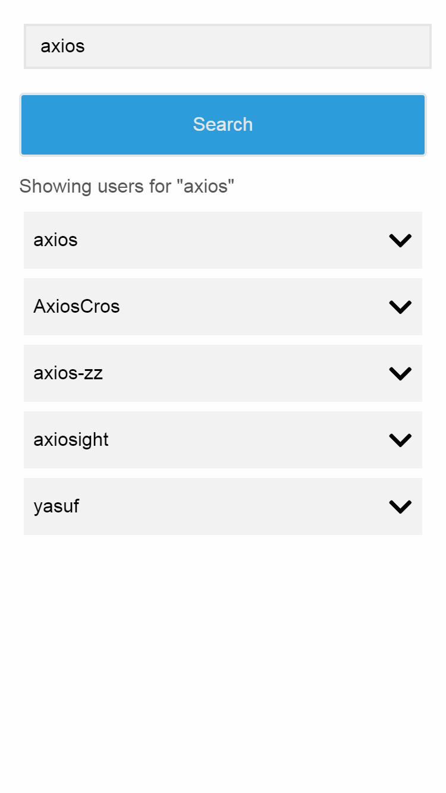
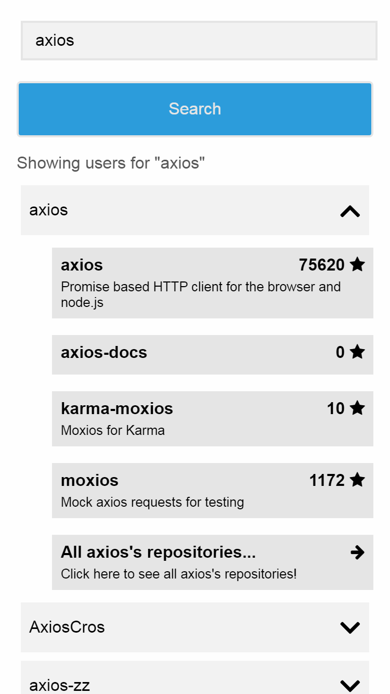
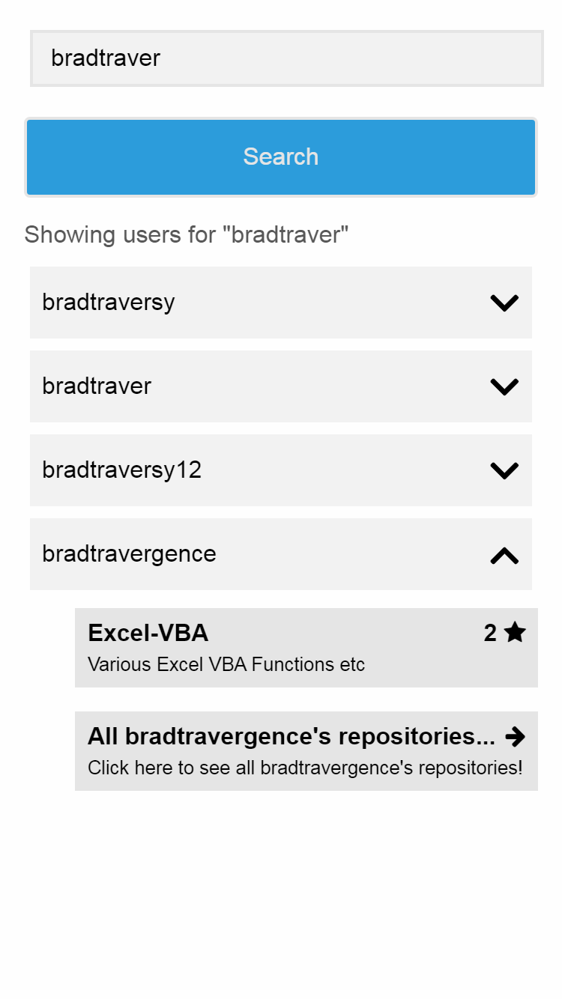

# Github Repositories Explorer

## 1. LIVE DEMO: 

## 2. DESCRIPTION

Github repositories explorer created with React and Redux. The application uses github.com API (https://developer.github.com/v3/) in order to search up to 
5 users with matching usernames and than display repositories (with titles, descriptions and number of stars) for selected user. Every repository result is a clickable link to a certain repository at GitHub.

## 3. INSTRUCTIONS HOW TO RUN LOCALLY

1. Go to project directory in your terminal (e.g. cd C:/project_directory/YND).
2. Run npm install in your terminal in order to install all dependencies.
3. Run npm start in your terminal in order to start local server.
4. Browse http://localhost:3000/ in your browser to see the App.

## 3. SCREENSHOTS:

#### 1. Homepage view
</img>

#### 2. Search results for 'axios'
</img>

#### 3. Axios' repositories with titles, descriptions and star counts
</img>

#### 4. Search results when less than 5 results match the search input
</img>

#### 5. Repositories view when number of repositories is less than 4
</img>
